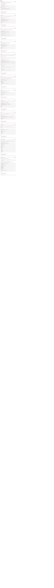

# ES6 data manipulation
## Resources
* [Array](https://developer.mozilla.org/en-US/docs/Web/JavaScript/Reference/Global_Objects/Array)
* [Typed Array](https://developer.mozilla.org/en-US/docs/Web/JavaScript/Guide/Typed_arrays)
* [Set Data Structure](https://developer.mozilla.org/en-US/docs/Web/JavaScript/Reference/Global_Objects/Set)
* [Map Data Structure](https://developer.mozilla.org/en-US/docs/Web/JavaScript/Reference/Global_Objects/Map)
* [WeakMap](https://developer.mozilla.org/en-US/docs/Web/JavaScript/Reference/Global_Objects/WeakMap)

## Requirements
* Code to be tested using the [Jest Testing Framework](https://jestjs.io/) and the command `npm run test`
* Code should be analyzed using the linter [ESLint](https://eslint.org/)

***NB: Don’t forget to run `$ npm install` when you have the `package.json`***

## Tasks

