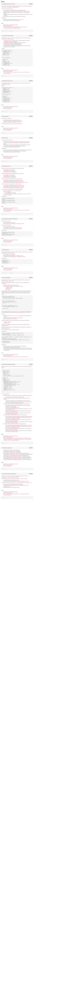

# Typescript
## Resources
* [TypeScript in 5 minutes](https://www.typescriptlang.org/docs/handbook/typescript-in-5-minutes.html)
* [TypeScript documentation](https://www.typescriptlang.org/docs/handbook/2/everyday-types.html)

## Requirements
* Your TS scripts will be checked with `jest` (version 24.9.* )
* Code should use the `ts` extension when possible
* The Typescript compiler should not show any warning or error when compiling your code

## Tasks

