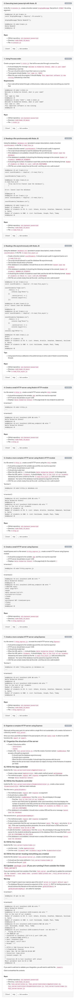

# NodeJS Basics
## Resources
* [Node JS getting started](https://nodejs.org/en/docs/guides/getting-started-guide)
* [Process API doc](https://node.readthedocs.io/en/latest/api/process/)
* [Child process](https://nodejs.org/api/child_process.html)
* [Express getting started](https://expressjs.com/en/starter/installing.html)
* [Mocha documentation](https://mochajs.org/)
* [Nodemon documentation](https://github.com/remy/nodemon#nodemon)

## Requirements
* Code will be tested using Jest and the command `npm run test`
* Code will be verified against lint using ESLint
* Code needs to pass all the tests and lint. You can verify the entire project running `npm run full-test`
* Functions/classes must be exported by using this format: `module.exports = myFunction;`

## Tasks

